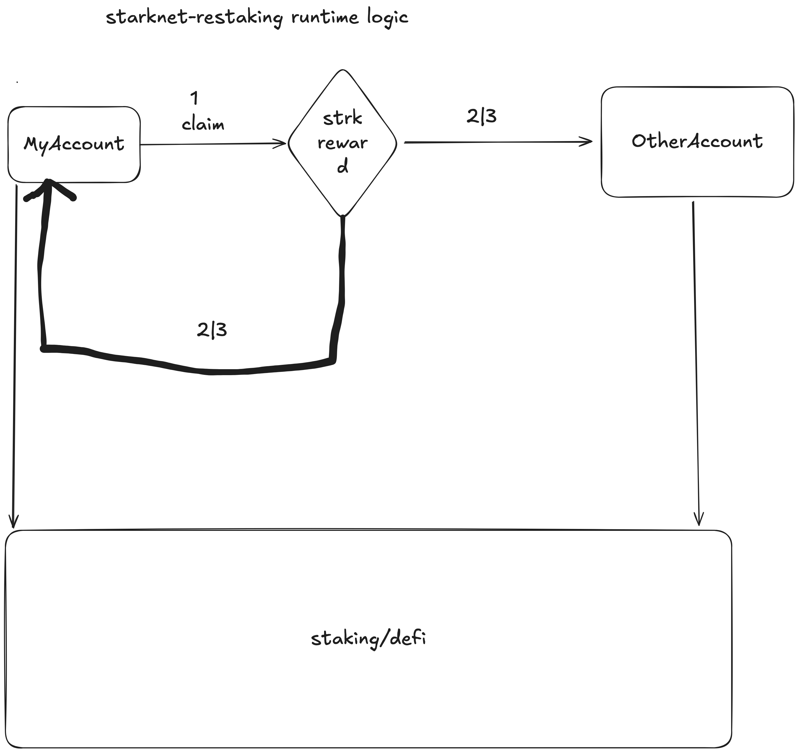

# 1. Deploy k3s cluster

```
curl -sfL https://get.k3s.io | sh -
```

# 2. fill my account info in cronjob-k3s.yaml

```
apiVersion: v1
kind: ConfigMap
metadata:
  name: my-config
data:
  PRIVATE_KEY: "" // fill this using yourself info
  ADDRESS: "" // fill this using yourself info
```

# 3. Run a cronjob

```
kubectl apply -f cronjob-k8s.yaml
```
